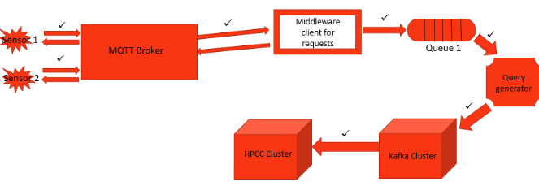

# MQTT-support-for-HPCC

A plugin to support MQTT protocol (A lightweight IOT protocol) in HPCC system’s architecture.

## Getting Started

Clone the files into your system. Complete all the required installations as mentioned below. 
Run the following in seperate terminals:
1. sudo /etc/init.d/hpcc-init start
2. mosquitto -v
3. sudo /usr/local/kafka/bin/kafka-server-start.sh /usr/local/kafka/config/server.properties
4. ecl publish roxie kafkaPublish.ecl
5. ecl run latestconsume.ecl (once cursor goes to next line, press ctrl-c)
6. python Client.py
7. python middlewareClient.py
8. python querygenerator.py
9. Go to localhost:8010 to see ECL watch. Under the landing zone you'll be able to see the data being collected as a file after every x min.

### Installing

* [HPCC CLUSTER](https://hpccsystems.com/training/documentation/installation-and-administration) - Enviroment for running (Download platform for ubuntu and install kafka plugin too)
* [KAFKA](https://www.digitalocean.com/community/tutorials/how-to-install-apache-kafka-on-ubuntu-14-04) - Installing Kafka
* [MQTT BROKER](https://www.digitalocean.com/community/tutorials/how-to-install-and-secure-the-mosquitto-mqtt-messaging-broker-on-ubuntu-16-04) - Installing MQTT BROKER

## Commands
Kafka : -
1. To start kafka:- sudo /usr/local/kafka/bin/kafka-server-start.sh /usr/local/kafka/config/server.properties

HPCC : -
1. to restart hpcc - sudo service hpcc-init restart
			or better = sudo /etc/init.d/hpcc-init start

2. to check status - sudo service hpcc-init status
3. publich - ecl publish --cluster=roxie name.ecl
4. unpublish - ecl unpublish roxie name.1
5. compile - eclcc name.ecl
6. run - ecl run roxie name.ecl

## System design

The proposed working system design is as shown in figure. Our system consists of the following components :-
<ul>
<li>Sensors</li>
<li>MQTT broker</li>
<li>Middleware client for requests</li>
<li>Queue</li
<li>Query generator</li>
<li>Kafka cluster</li>
<li>HPCC cluster</li>

All the components are further explained briefly:-

<b>Sensor</b>

Numerous number of sensors produce information every few seconds. Such a huge amount of data would become essential to analyze and conclude results in a particular application.  

<b>MQTT Broker</b>

The MQTT broker used is the Mosquito broker. For each application, the corresponding sensors publish the data to a particular topic.  

<b>Middleware client for Requests</b>

The middleware client is subscribed to all the topics. Thus, if a new sensor is added dynamically, it is handled effortlessly by our client.

<b>Queue</b>

A queue between the two processes is needed because of the type of protocols used. MQTT is a stateful protocol where as Roxie is stateless. To bridge these two, an external datastore is required and a fifo queue is the best choice for the discussed application.

<b>Query generator</b>

The query generator picks the data from the queue and generates a http request to the kafka cluster. An ECL roxie query(categorizing the data in the expected format) is published once for every application. The http request just invokes it.  

<b>Kafka Cluster</b>

The kafka cluster is now filled with data received from the query generator. Once every x minutes,  the data is sprayed onto the hpcc cluster in the form of new subfiles.

<b>HPCC cluster</b>

The HPCC cluster now has the data of a particular application under one superfile which is made up of many subfiles. At the time of analysis, the data from these subfiles are considered as one unit. Analysis results can be used for predicting, future parameters using appropriate machine learning algorithms.

